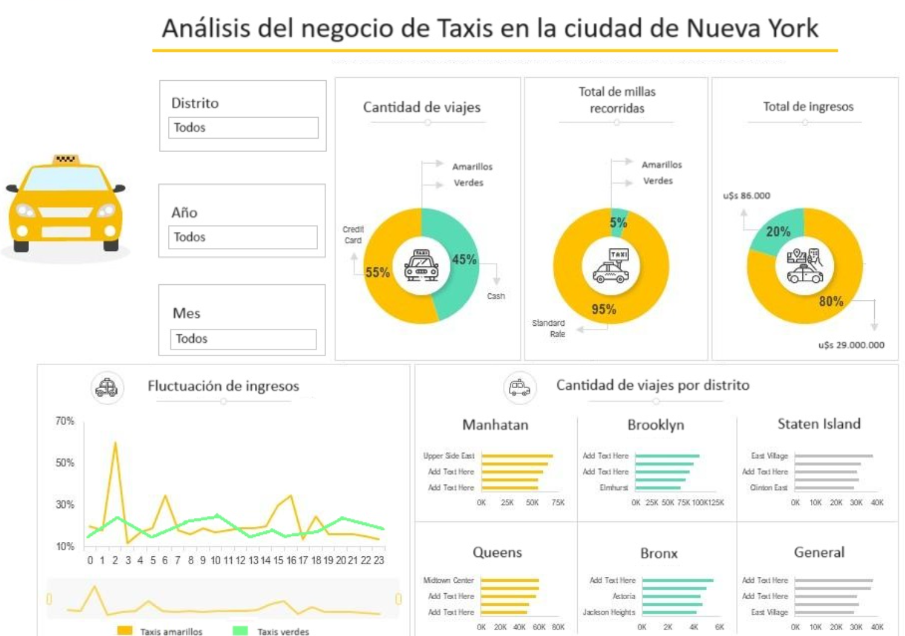

# NewYorkDrive - Transporte Sostenible

## Contexto
.

La empresa "NewYorkDrive" busca expandirse al transporte de pasajeros con automóviles, explorando la viabilidad de incorporar vehículos eléctricos para reducir la contaminación y mejorar la calidad del aire y sonido en la ciudad de Nueva York.

Este proyecto tiene como objetivo respaldar la toma de decisiones de "NewYorkDrive" para implementar una nueva línea de transporte. Se llevará a cabo una investigación exhaustiva utilizando datos de alta calidad para analizar las características fundamentales que influirán en estas decisiones.

## Tabla de Contenidos

- [Equipo de Trabajo](https://github.com/IsmaDeveloper16/Proyecto-final#Equipo-de-Trabajo)
- [Metodología de Trabajo](https://github.com/IsmaDeveloper16/Proyecto-final#Metodología-de-Trabajo)
- [Alcance](https://github.com/IsmaDeveloper16/Proyecto-final#Alcance)
- [Stack Tecnológico](https://github.com/IsmaDeveloper16/Proyecto-final#Stack-Tecnológico)
- [Diagrama de entidad - relación](https://github.com/IsmaDeveloper16/Proyecto-final#Diagrama-de-entidad---relación)
- [Dashboard](https://github.com/IsmaDeveloper16/Proyecto-final#Dashboard)
- [KPIs](https://github.com/IsmaDeveloper16/Proyecto-final#KPIs)
- [Conclusión](https://github.com/IsmaDeveloper16/Proyecto-final#Conclusión)

## Equipo de Trabajo

## Metodología de Trabajo

Hemos adoptado la metodología ágil Scrum, utilizando herramientas como Trello para la gestión de tareas. Esta metodología nos permite abordar complejidades con iteraciones cortas y entregas incrementales, fomentando la flexibilidad, la adaptación constante y la colaboración entre equipos.

- Semana 1: Esta etapa constituye la puesta en marcha del proyecto y el tratamiento de los datos. Se trazan los objetivos, los alcances del proyecto así como los KPIs a evaluar. Además, se realiza el EDA preliminar de los datos.
    
- Semana 2: Etapa de Data Engineering. Se crea, se implementa y se automatiza el datawarehouse. Además, se plantean los MVPs del dashboard y de los modelos de Machine Learning preliminares.
    
- Semana 3: Etapa final. Se completa principalmente el dashboard y se presenta el producto de Machine Learning. Además se realiza la entrega de la documentación y del repositorio completo.

## Alcance

- Introducir una flota de vehículos eléctricos considerando aspectos de energías alternativas, impacto ambiental y rentabilidad.
- Cumplir con acuerdos para reducir la huella de carbono y generar un impacto positivo en la comunidad.

## Stack Tecnológico

- **Google Colab**
- **Python**
- **Google Cloud Platform (GCP)**
    - Cloud Function
    - Google Cloud Scheduler
    - Google Cloud Storage
    - BigQuery
- **Power BI**
- **Vertex AI**

## Diagrama de entidad - relación

A continuación se presenta el diagrama entidad - relación del modelo presente en nuestro datawarehouse, Big Query.

## Dashboard
El dashboard a continuación resume los resultados clave obtenidos durante el proyecto de implementación de vehículos eléctricos en la flota de transporte de "NewYorkDrive". Estos gráficos representan métricas esenciales para evaluar la viabilidad, impacto ambiental y eficiencia del sistema de transporte propuesto.

## KPIs

Entre los KPIs que seguimos se encuentran:

- Retorno de inversión (ROI) esperado.
    - El retorno esperado por la implementación de vehículos eléctricos va a ser de un 20% luego del período de 6 años.

- Reducción de emisión de carbono.
    - La Reducción de Emisiones es un indicador clave de rendimiento que evalúa la efectividad de las medidas adoptadas para reducir las emisiones generadas por los vehículos de combustión.

- Eficiencia de las rutas.
    - Nos enfocamos en evaluar la eficiencia de las rutas de los taxis, con el objetivo de optimizar la distancia promedio recorrida por cada viaje.

## Conclusión

Este proyecto representa un paso significativo hacia la transformación del sistema de transporte, al buscar implementar una solución más sostenible y eficiente. Se ha llevado a cabo un análisis exhaustivo respaldado por un equipo multidisciplinario con un enfoque colaborativo y una metodología ágil.

El proyecto comenzó identificando la problemática: la necesidad de expandir el servicio de transporte de pasajeros hacia vehículos más sostenibles. La introducción planteó la visión de la empresa de alinearse con tendencias de mercado y prácticas sostenibles. El equipo de trabajo, conformado por expertos en datos, ingeniería y aprendizaje automático, se ha centrado en la selección y uso de tecnologías adecuadas para abordar esta problemática.

La vida del dato ha sido fundamental, desde la obtención a través de técnicas como web scraping y acceso a APIs, hasta el Análisis Exploratorio detallado para comprender la estructura y la calidad de los datos. La automatización de procesos mediante Cloud Functions y Cloud Scheduler ha asegurado una gestión eficiente y organizada de datos en BigQuery, sentando así las bases para futuros análisis y modelos de Machine Learning.

Este proyecto representa un esfuerzo integral para desarrollar un sistema de transporte más sostenible y eficiente. El enfoque colaborativo, la cuidadosa gestión de datos, el análisis profundo y la definición de KPIs nos han guiado hacia una toma de decisiones informada y estratégica en pos de un futuro más sostenible en el transporte de pasajeros.

