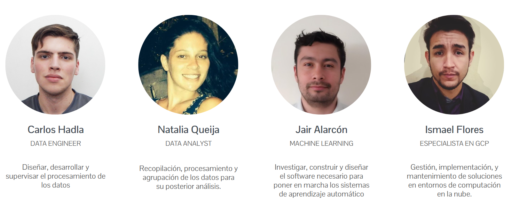
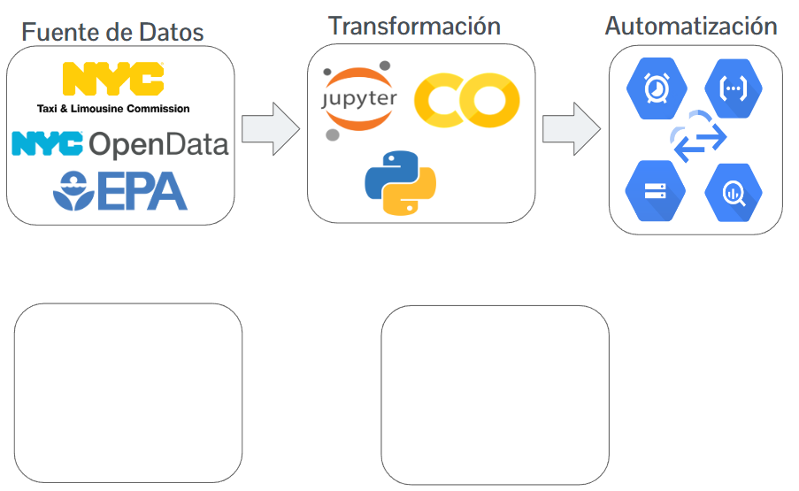

# NewYorkDrive - Transporte Sostenible

## Conetexto
.

<<<<<<< HEAD
=======

>>>>>>> c2f5d6ed4dcf2f9289366f65835ed679687beeb8
La empresa "NewYorkDrive" busca expandirse al transporte de pasajeros con automóviles, explorando la viabilidad de incorporar vehículos eléctricos para reducir la contaminación y mejorar la calidad del aire y sonido en la ciudad de Nueva York.

Este proyecto tiene como objetivo respaldar la toma de decisiones de "NewYorkDrive" para implementar una nueva línea de transporte. Se llevará a cabo una investigación exhaustiva utilizando datos de alta calidad para analizar las características fundamentales que influirán en estas decisiones.

## Tabla de Contenidos

- [Equipo de Trabajo](https://github.com/IsmaDeveloper16/Proyecto-final#Equipo-de-Trabajo)
- [Metodología de Trabajo](https://github.com/IsmaDeveloper16/Proyecto-final#Metodología-de-Trabajo)

- [Alcance](https://github.com/IsmaDeveloper16/Proyecto-final#Alcance)
- [Stack Tecnológico](https://github.com/IsmaDeveloper16/Proyecto-final#Stack-Tecnológico)
- [Diagrama de entidad - relación](https://github.com/IsmaDeveloper16/Proyecto-final#Diagrama-de-entidad---relación)
- [KPIs](https://github.com/IsmaDeveloper16/Proyecto-final#KPIs)
- [Conclusión](https://github.com/IsmaDeveloper16/Proyecto-final#Conclusión)

## Equipo de Trabajo

## Metodología de Trabajo

Hemos adoptado la metodología ágil Scrum, utilizando herramientas como Trello para la gestión de tareas. Esta metodología nos permite abordar complejidades con iteraciones cortas y entregas incrementales, fomentando la flexibilidad, la adaptación constante y la colaboración entre equipos.

- Semana 1: Esta etapa constituye la puesta en marcha del proyecto y el tratamiento de los datos. Se trazan los objetivos, los alcances del proyecto así como los KPIs a evaluar. Además, se realiza el EDA preliminar de los datos.
    
- Semana 2: Etapa de Data Engineering. Se crea, se implementa y se automatiza el datawarehouse. Además, se plantean los MVPs del dashboard y de los modelos de Machine Learning preliminares.
    
- Semana 3: Etapa final. Se completa principalmente el dashboard y se presenta el producto de Machine Learning. Además se realiza la entrega de la documentación y del repositorio completo.

## Alcance

- Introducir una flota de vehículos eléctricos considerando aspectos de energías alternativas, impacto ambiental y rentabilidad.
- Cumplir con acuerdos para reducir la huella de carbono y generar un impacto positivo en la comunidad.

## Stack Tecnológico

- **Google Colab**
- **Python**
- **Google Cloud Platform (GCP)**
    - Cloud Function
    - Google Cloud Scheduler
    - Google Cloud Storage
    - BigQuery
- **Power BI**
- **Vertex AI**

## Diagrama de entidad - relación

A continuación se presenta el diagrama entidad - relación del modelo presente en nuestro datawarehouse, Big Query.

## KPIs

Entre los KPIs que seguimos se encuentran:

- Retorno de inversión (ROI) esperado
- Reducción de emisión de carbono
- Eficiencia de las rutas

## Conclusión

Este proyecto representa un paso significativo hacia la implementación de una solución de transporte sostenible y eficiente para la empresa 'NewYorkDrive'. Estamos comprometidos con la búsqueda de soluciones que impulsen la rentabilidad del negocio y fomenten un impacto positivo en el medio ambiente y en la calidad de vida de la comunidad.
