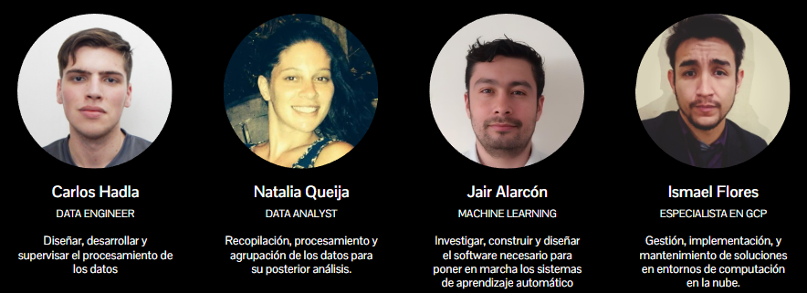
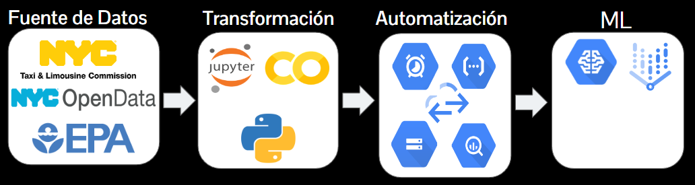
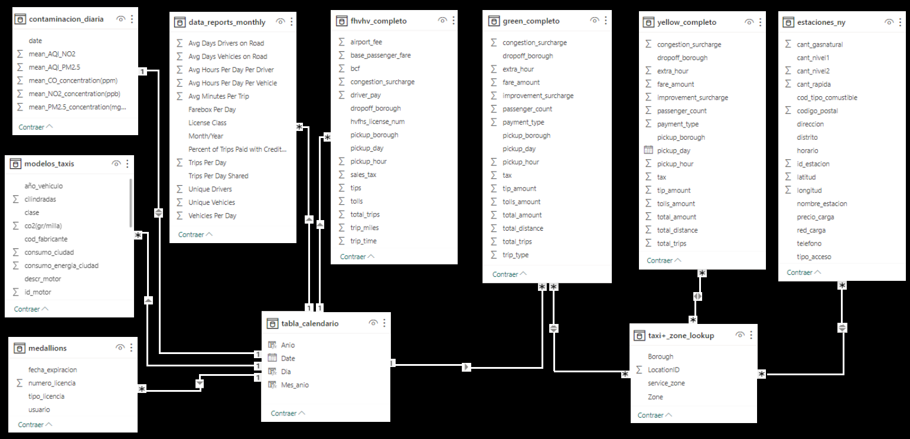
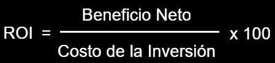
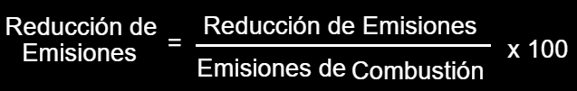

# NewYorkDrive - Sustainable Transport

## Context
.

The company "NewYorkDrive" aims to expand into passenger transportation using automobiles, exploring the feasibility of incorporating electric vehicles to reduce pollution and improve air and sound quality in the city of New York.

This project aims to support the decision-making process of "NewYorkDrive" in implementing a new transportation line. A comprehensive investigation will be conducted, utilizing high-quality data to analyze the fundamental characteristics that will influence these decisions.

## Index

- [Work Team](https://github.com/IsmaDeveloper16/Proyecto-final#Equipo-de-Trabajo)
- [Work Methodology](https://github.com/IsmaDeveloper16/Proyecto-final#Metodología-de-Trabajo)
- [Scope](https://github.com/IsmaDeveloper16/Proyecto-final#Alcance)
- [Technology Stack](https://github.com/IsmaDeveloper16/Proyecto-final#Stack-Tecnológico)
- [ER Diagram](https://github.com/IsmaDeveloper16/Proyecto-final#Diagrama-de-entidad---relación)
- [Dashboard](https://github.com/IsmaDeveloper16/Proyecto-final#Dashboard)
- [KPIs](https://github.com/IsmaDeveloper16/Proyecto-final#KPIs)
- [Conclusion](https://github.com/IsmaDeveloper16/Proyecto-final#Conclusión)

## Work Team

## Work Methodology

We have adopted the agile methodology 'Scrum', using tools such as Trello for task management. This methodology allows us to address complexities with short iterations and incremental deliveries, promoting flexibility, constant adaptation, and collaboration between teams.

Week 1: This stage constitutes the project's kickoff and data handling. Objectives, project scopes, as well as KPIs to evaluate, are outlined. Additionally, preliminary Exploratory Data Analysis (EDA) is conducted on the data.

Week 2: Data Engineering stage. The data warehouse is created, implemented, and automated. Additionally, the Minimum Viable Products (MVPs) for the dashboard and preliminary Machine Learning models are proposed.

Week 3: Final stage. Primarily completing the dashboard and presenting the Machine Learning product. Additionally, delivering documentation and the complete repository.

## Scope

- Introducing a fleet of electric vehicles considering aspects of alternative energies, environmental impact, and profitability.
- Meeting agreements to reduce the carbon footprint and generate a positive impact on the community.

## Technology Stack

- **Google Colab**
- **Python**
- **Google Cloud Platform (GCP)**
    - Cloud Function
    - Google Cloud Scheduler
    - Google Cloud Storage
    - BigQuery
- **Power BI**
- **Vertex AI**

## ER Diagram

Below is the entity-relationship diagram of the model in our BigQuery data warehouse.

## Dashboard
The following dashboard summarizes the key results obtained during the implementation project of electric vehicles in the transportation fleet of 'NewYorkDrive'.

Five sheets have been created:

1) 'Statistics', displaying the general business statistics over the past 10 years.
2) 'ROI', where the return on investment is analyzed comparatively between combustion and electric cars. For both cases, the net profits were predicted using the Machine Learning model, and investment and fuel costs were calculated based on the obtained data.
3) 'Route Efficiency', evaluating average trip times, distances traveled, and exploring potential route efficiency improvements through various graphs and applications.
4) 'Fuel Costs', analyzing the difference in charging costs between a combustion car and electric cars, clearly reflecting a decrease in fuel costs if the fleet switches to electric vehicles.
5) 'Emission Reduction', where we analyze both the gases emitted by the cars and the sound pollution in the city.

You can find the final dashboard in the following link: [dashboard-taxis-NY](https://drive.google.com/file/d/1pT3l3fyY6wDz4gvg4WQEiNGCzplDuKW6/view?usp=sharing)

## KPIs

- Expected Return on Investment (ROI).
The expected return for the implementation of electric vehicles is projected to be 20% after a 6-year period.

- Carbon Emission Reduction.

Carbon Emission Reduction is a key performance indicator that assesses the effectiveness of measures taken to reduce emissions generated by combustion vehicles.

- Route Efficiency.

We focus on evaluating the efficiency of taxi routes with the aim of optimizing the average distance traveled for each trip.

## Conclusi0n

This project represents a significant step towards transforming the transportation system by aiming to implement a more sustainable and efficient solution. It involved a comprehensive analysis supported by a multidisciplinary team with a collaborative approach and an agile methodology.

The project commenced by identifying the issue: the need to expand the passenger transportation service toward more sustainable vehicles. The introduction highlighted the company's vision to align with market trends and sustainable practices. The team, comprised of experts in data, engineering, and machine learning, focused on selecting and utilizing appropriate technologies to address this challenge.

Data lifecycle has been pivotal, starting from acquisition through techniques like web scraping and API access, leading to detailed Exploratory Data Analysis to understand data structure and quality. Process automation via Cloud Functions and Cloud Scheduler ensured an efficient and organized data management in BigQuery, laying the groundwork for future analyses and Machine Learning models.

This project represents a comprehensive effort to develop a more sustainable and efficient transportation system. The collaborative approach, meticulous data management, in-depth analysis, and definition of KPIs have guided us toward an informed and strategic decision-making process, aiming for a more sustainable future in passenger transportation.
